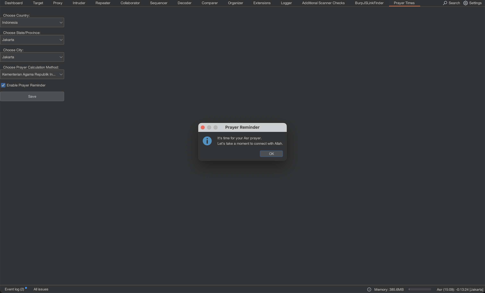

<h1 align="center">Burp Suite Prayer Times Reminder Extension</h1>

  <a href="#overview">Overview</a> •
  <a href="#installation">Installation</a> •
  <a href="#configuration">Configuration</a> •
  <a href="#credits">Credits</a> 

---

## Overview
A simple Burp Suite extension that reminds you of prayer times / sholat reminder throughout the day. Designed for security engineers and pentesters, this extension helps you stay on track with your daily prayers without disrupting your focus during penetration testing or other security tasks

## Installation
1. Download the extension file
2. Open Burp Suite
3. Go to Extender tab
4. Click "Add" button
5. Select the extension file
6. The extension will appear as "Prayer Times" in the extensions list

## Configuration
1. In Burp Suite, navigate to "Prayer Times tab.
2. Choose your country, state, and city.
3. Choose prayer calculation method.
4. Save your settings.

## Credits
### Contributing

We welcome contributions! Feel free to submit [Pull Requests](https://github.com/luqmanhy/burp-prayer-times/pulls) or report [Issues](https://github.com/luqmanhy/burp-prayer-times/issues).

### Licensing

This utility is licensed under the [MIT license](https://opensource.org/license/mit). You are free to use, modify, and distribute it, as long as you follow the terms of the license. You can find the full license text in the repository - [Full MIT license text](https://github.com/luqmanhy/burp-prayer-times/blob/master/LICENSE).

